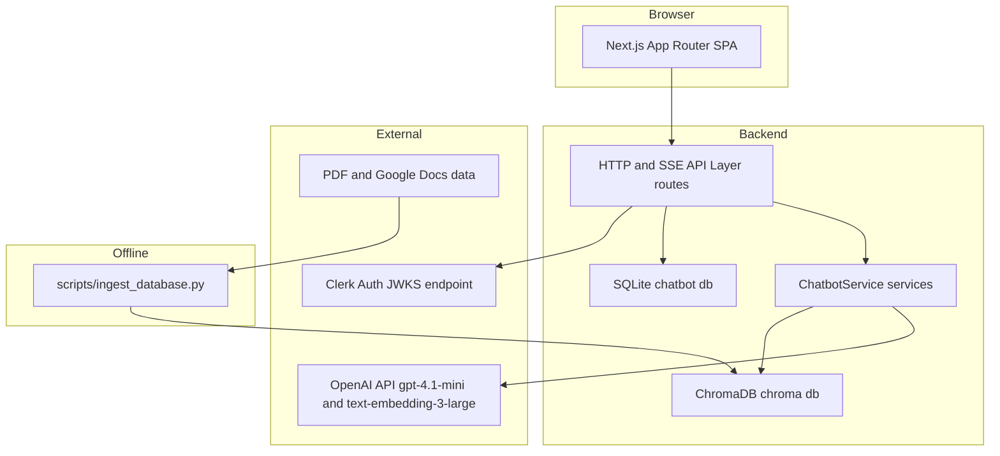
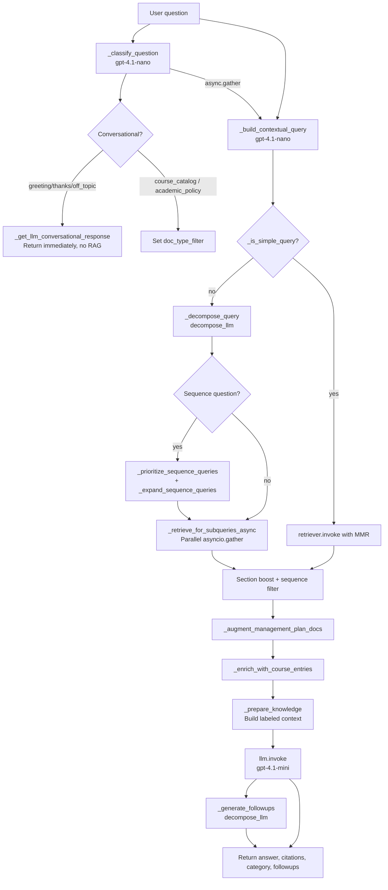
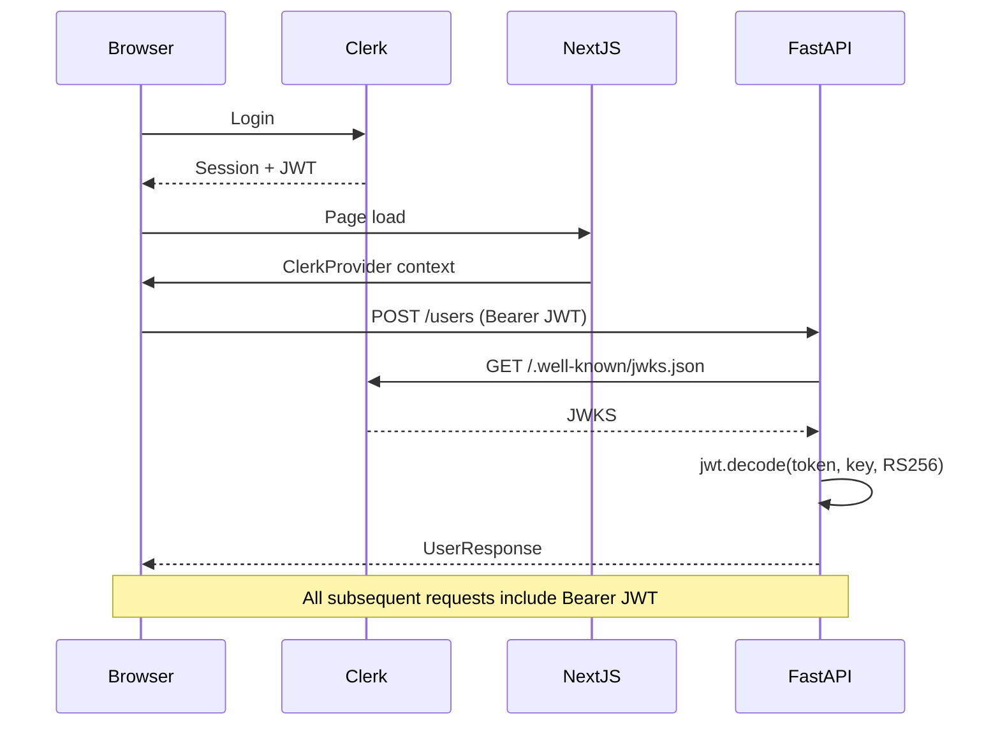

# Architecture Analysis: OIRA Chatbot

> As of 4/2/26.

## Executive Summary

OIRA Chatbot is an AI-powered course catalog and academic policy assistant for Bucknell University. It is organized as a monorepo with two independent applications: a Python/FastAPI backend that owns all AI and data logic, and a Next.js frontend that owns all user interaction. The two sides communicate exclusively over a documented REST/SSE API.

The architecture is layered and separation-conscious at every level. The backend is subdivided into a `core/` infrastructure layer, a `routes/` HTTP-adapter layer, a `services/` business-logic layer, a `prompts/` prompt-template layer, and a `scripts/` offline data-pipeline. The frontend mirrors this discipline: shared TypeScript types are centralized in `app/types.ts`, all API calls are isolated in `app/utils/api.ts`, session management logic lives in a custom hook, and UI components are kept stateless where possible.

The defining technical choice is Retrieval-Augmented Generation (RAG): instead of relying on an LLM's parametric knowledge, every factual answer is grounded in chunks retrieved from an embedded, locally-hosted ChromaDB vector store loaded from Bucknell's official PDFs. Classification, contextualization, decomposition, and generation are separate LLM calls that can run in parallel, giving the system a sophisticated multi-step query pipeline that balances answer quality against latency and cost.

---

## Architectural Style

**Primary pattern: Layered Monorepo with RAG-driven backend**

The system does not use microservices. It is intentionally a simple two-process monolith (one FastAPI process, one Next.js process) that communicates over HTTP. The RAG pipeline within the backend is itself a mini-pipeline architecture: each message passes through classifier → contextualizer → decomposer → retriever → enricher → generator → follow-up generator, with each stage being a discrete, replaceable function.

**Secondary patterns in use:**

| Pattern                       | Where                                 | Why                                                |
| ----------------------------- | ------------------------------------- | -------------------------------------------------- |
| Repository pattern (informal) | `core/database.py` + SQLAlchemy ORM | Separate DB access from route logic                |
| Service layer                 | `services/chatbot_service.py`       | Isolate RAG complexity from HTTP routers           |
| Dependency Injection          | FastAPI `Depends()`                 | Thread-safe DB sessions, auth per-request          |
| Custom React Hook             | `useSessionManager.ts`              | Encapsulate complex session lifecycle logic        |
| SSE streaming                 | `/chat/stream` endpoint             | Progressively render LLM tokens to the user        |
| Background task               | `asyncio.create_task()`             | Non-blocking memory/summarization after response   |
| Singleton service             | `get_chatbot_service()`             | Avoid re-loading ChromaDB vector store per request |

---

## System Overview



**Reading the diagram:** The browser never touches ChromaDB, OpenAI, or SQLite directly. All external calls are mediated by the FastAPI backend. The ingestion script is a one-time / scheduled offline tool that populates ChromaDB from source PDFs; the runtime backend only reads ChromaDB, never writes to it during normal operation.

---

## Layers and Modules

### Backend Layers

#### 1. Infrastructure Layer — `backend/core/`

**Purpose:** Centralize cross-cutting infrastructure concerns so every route module imports from one place.

| File                         | Role                                                                                              |
| ---------------------------- | ------------------------------------------------------------------------------------------------- |
| `backend/core/config.py`   | Loads `.env`, exposes all constants (OpenAI keys, ChromaDB paths, tuning knobs)                 |
| `backend/core/database.py` | SQLAlchemy engine,`SessionLocal`, ORM models (`User`, `Session`, `Message`, `Feedback`) |
| `backend/core/models.py`   | All Pydantic request/response schemas (the public API contract)                                   |
| `backend/core/auth.py`     | Clerk JWT verification via JWKS; FastAPI `Depends(get_current_user)`                            |

**Why this exists:** Every route module needs a database session, a verified user, and typed request/response schemas. Centralizing these in `core/` means a route file imports four lines and gets everything it needs.

**Key design detail:** `config.py` reads the environment once at import time. Every downstream module imports `from core import config`. This is a simple module-level singleton — no OOP Config class needed.

---

#### 2. HTTP Adapter Layer — `backend/routes/`

**Purpose:** Handle HTTP concerns only — request parsing, auth injection, DB session injection, response serialization, and error translation. No business logic lives here.

| File                   | Prefix               | Key operations                                                                         |
| ---------------------- | -------------------- | -------------------------------------------------------------------------------------- |
| `routes/users.py`    | `/users`           | POST (upsert Clerk user into SQLite)                                                   |
| `routes/sessions.py` | `/sessions`        | GET (list), DELETE, PATCH, POST `/generate-title`                                    |
| `routes/messages.py` | `/messages`        | GET (history), POST `/edit`                                                          |
| `routes/chat.py`     | `/chat`            | POST (sync), POST `/stream` (SSE), POST `/regenerate`, POST `/regenerate/stream` |
| `routes/feedback.py` | `/feedback`        | POST (thumbs up/down + note)                                                           |
| `routes/schedule.py` | `/schedule/upload` | POST (multipart file + session_id)                                                     |
| `routes/admin.py`    | `/admin/ingest`    | POST (triggers re-ingestion via subprocess)                                            |

**Why every route follows the same shape:** Each endpoint (1) extracts the Clerk user ID from the injected JWT payload, (2) looks up the `DBUser` row, (3) verifies session ownership, (4) calls into the service layer, (5) persists the result, (6) returns a Pydantic response model.

---

#### 3. Service Layer — `backend/services/`

**Purpose:** All AI/ML and domain logic lives here, completely decoupled from HTTP.

| File                               | Role                                                                                    |
| ---------------------------------- | --------------------------------------------------------------------------------------- |
| `services/chatbot_service.py`    | Core RAG pipeline:`ChatbotService` class + `get_chatbot_service()` singleton getter |
| `services/schedule_parser.py`    | OCR extraction + regex-based course code parsing                                        |
| `services/google_docs_loader.py` | Fetches and caches Google Docs as markdown for ingestion                                |

**Why a singleton:** `ChatbotService.__init__()` connects to ChromaDB and constructs the LangChain retriever. These operations are expensive. The singleton pattern ensures the vector store is loaded once per process.

---

#### 4. Prompt Template Layer — `backend/prompts/`

**Purpose:** Keep all prompt engineering in editable, version-controlled `.md` files instead of embedded string literals.

| File                               | Role                                                                                          |
| ---------------------------------- | --------------------------------------------------------------------------------------------- |
| `prompts/system.md`              | Fallback system prompt (general RAG instructions, formatting rules, hallucination prevention) |
| `prompts/system_catalog.md`      | System prompt for course catalog questions                                                    |
| `prompts/system_policy.md`       | System prompt for academic policy questions                                                   |
| `prompts/question_classifier.md` | Classifier prompt template (6-category JSON output)                                           |
| `prompts/decompose.md`           | Query decomposition prompt (returns `{type, sub_questions}` JSON)                           |
| `prompts/contextualize.md`       | Contextualizes follow-up questions using conversation history                                 |
| `prompts/conversational.md`      | Prompt for greeting / thanks / off-topic responses                                            |

**Why `.md` files:** Prompt text contains markdown formatting, multi-paragraph instructions, and structured examples. Storing them in `.md` files keeps them editable by anyone without touching Python, enables Git diffs to be readable, and avoids Python string escaping problems. `prompts/__init__.py` loads all templates at import time.

---

#### 5. Data Pipeline Layer — `backend/scripts/`

**Purpose:** Offline tools to build and maintain the vector database and SQLite schema.

| File                           | Role                                                |
| ------------------------------ | --------------------------------------------------- |
| `scripts/ingest_database.py` | Load PDFs → chunk → embed → upsert into ChromaDB |
| `scripts/migrate_db.py`      | Safe incremental schema migration                   |
| `scripts/recreate_db.py`     | Destructive drop-and-recreate (development only)    |
| `scripts/test_setup.py`      | Smoke test the environment                          |

**Key ingestion logic:** For the course catalog, `extract_course_documents()` uses `COURSE_START_RE` (a regex matching `ANBE 266: ...` or `#### **ANBE 266. ...`) to split the catalog into one `Document` per course entry. This gives much tighter semantic units than fixed-size character chunks.

---

### Frontend Layers

#### 1. Configuration and Utilities — `frontend/app/utils/`

| File                            | Role                                                                        |
| ------------------------------- | --------------------------------------------------------------------------- |
| `utils/config.ts`             | Single source of truth for `API_URL`                                      |
| `utils/api.ts`                | Pure async functions for every backend API call (no state, no side effects) |
| `utils/auth.ts`               | `authenticatedFetch` wrapper; token injection helper                      |
| `utils/session.ts`            | Session title generation helpers                                            |
| `utils/sessionStorage.ts`     | `localStorage` read/write for session ID persistence across reloads       |
| `utils/useSessionManager.ts`  | Custom hook: full session lifecycle state machine                           |
| `utils/suggestedQuestions.ts` | Static grouped suggested question bank                                      |

**Why separate `api.ts` from `auth.ts`:** `api.ts` owns the shapes of all fetch calls and return types. `auth.ts` owns the mechanics of attaching a Bearer token. This layering keeps the API-surface testable without Clerk mocking.

---

#### 2. Shared Types — `frontend/app/types.ts`

All TypeScript interfaces that cross component or utility boundaries: `Citation`, `Message`, `ChatResponse`, `MessagesResponse`, `SessionSummary`, `ParsedCourse`, `ScheduleUploadResponse`, `Theme`. This is the frontend's contract with the backend.

---

#### 3. Application Shell — `frontend/app/page.tsx`

The root page owns:

- Auth state (Clerk `useAuth`, `useUser`)
- User initialization (calls `POST /users` on first login)
- Session lifecycle (delegates to `useSessionManager`)
- Theme persistence (`localStorage` + `document.documentElement.dataset.theme`)
- Layout: renders `<Sidebar>` + `<ChatInterface>` side by side

---

#### 4. UI Components — `frontend/app/components/`

| Component             | Role                                                                                                                      |
| --------------------- | ------------------------------------------------------------------------------------------------------------------------- |
| `Sidebar.tsx`       | Left panel: session list, search overlay (portalled), resize handle, Clerk `UserButton`                                 |
| `ChatInterface.tsx` | Full chat pane: message history loading, SSE streaming, edit/regenerate, schedule upload, welcome screen                  |
| `MessageList.tsx`   | Scroll container rendering the array of `MessageItem`                                                                   |
| `MessageItem.tsx`   | Single message bubble: character-by-character animation, citations panel, follow-up chips, feedback (thumbs), edit inline |
| `MessageInput.tsx`  | Textarea with send button, schedule upload trigger                                                                        |

---

## Key Components Deep Dive

### ChatbotService — The Heart of the System

**File:** `backend/services/chatbot_service.py`

Three public methods:

| Method                     | Use case                                                               |
| -------------------------- | ---------------------------------------------------------------------- |
| `get_answer()`           | Synchronous (used by schedule upload)                                  |
| `get_answer_async()`     | Async, parallel LLM calls (used by `/chat` and `/chat/regenerate`) |
| `get_answer_streaming()` | Async generator yielding SSE events (used by `/chat/stream`)         |

All three methods execute the same conceptual pipeline — they differ in whether LLM calls are sequential, parallel, or streamed.

**The RAG Pipeline (per request):**



**Three LLM instances, different roles:**

```
self.llm            = gpt-4.1-mini  @ temp=0.3   — main answer generation
self.decompose_llm  = gpt-4.1-nano  @ temp=0.1   — decompose, contextualize, followups, summarize
self.classifier_llm = gpt-4.1-nano  @ temp=0.1   — question classification
```

Heavier model for final answers, cheaper nano model for all pre-retrieval work. Deliberate cost/quality trade-off.

**The retriever configuration:**

```python
self.retriever = self.vector_store.as_retriever(
    search_type="mmr",
    search_kwargs={
        "k": 12,        # Final docs returned
        "fetch_k": 80,  # Candidate pool for MMR
        "lambda_mult": 0.4  # Diversity bias (0=diverse, 1=similar)
    }
)
```

MMR (Maximal Marginal Relevance) with `lambda_mult=0.4` actively penalizes returning similar chunks, preventing the context window from being flooded with repetitive course descriptions.

---

### The SSE Streaming Architecture

`/chat/stream` returns `StreamingResponse` with `media_type="text/event-stream"`. Event sequence:

```
event: user       → {"message_id": 42}          ← user message stored
event: metadata   → {"category": "...", "citations": [...]}
event: token      → {"token": "Here "}           ← repeated per token
event: followups  → {"follow_ups": [...]}
event: saved      → {"message_id": 99}           ← assistant message persisted
event: done       → {"answer": "...", "citations": [...], "category": "..."}
```

The frontend maintains a streaming placeholder message in React state. As `token` events arrive, it appends to the placeholder. When `saved` arrives, it swaps the placeholder's ID to the real DB ID for feedback association.

---

### Authentication Flow



**Dev vs. prod:** In development (`CLERK_SECRET_KEY` set), `core/auth.py` decodes the JWT without signature verification. In production, it fetches Clerk's JWKS and verifies using RS256. `@lru_cache()` on `get_clerk_jwks()` fetches JWKS only once per process lifetime.

---

## Cross-Cutting Concerns

### Conversation Memory (Three-Tier)

**Tier 1 — Verbatim window:** Last `SUMMARY_WINDOW_SIZE` (default: 6) messages passed verbatim to the LLM.

**Tier 2 — Rolling summary:** Older messages are compressed into a 3-6 sentence summary stored in `Session.conversation_summary`, preventing unbounded context growth.

**Tier 3 — User profile facts:** Every user message is scanned by `_extract_user_facts()` to detect persistent facts (major, year, completed courses). Stored as JSON in `User.profile_facts`, prepended to every subsequent prompt — the chatbot "remembers" across sessions.

**Why background tasks:** Memory operations require LLM calls. Running them on the critical path would add 500-1000ms. `asyncio.create_task()` runs them concurrently while the user reads the answer.

---

### Citations Pipeline

1. **Ingestion:** ChromaDB metadata stores `source` (file path), `page`, `doc_type`, `section`, `course_code`
2. **Retrieval:** `_prepare_knowledge()` wraps each chunk with `[filename, p. N]` headers
3. **Response building:** Each retrieved doc becomes a `Citation` dict with `content`, `source`, `page`, `url`, `doc_type`
4. **Storage:** Citations are JSON-serialized into `Message.citations` (a `Text` column)
5. **Display:** `MessageItem.tsx` renders citations in a collapsible panel with links to `catalog.pdf#page=N`

---

## API Contract Between Frontend and Backend

All endpoints require `Authorization: Bearer <clerk_jwt>`.

**`POST /users`**

```json
// Request
{ "clerk_user_id": "user_xxx", "email": "student@bucknell.edu", "name": "Jane Doe" }
// Response
{ "id": 1, "clerk_user_id": "user_xxx", "email": "...", "name": "...", "created_at": "..." }
```

**`POST /chat`**

```json
// Request
{ "session_id": "uuid-v4", "message": "What are the prereqs for CSCI 204?" }
// Response
{
  "message_id": 99,
  "user_message_id": 98,
  "answer": "CSCI 204 requires...",
  "citations": [{ "content": "...", "source": "2025-2026 course catalog.pdf", "page": 42, "url": "/catalog.pdf#page=42", "doc_type": "catalog" }],
  "session_id": "uuid-v4",
  "question_category": "course_catalog",
  "follow_ups": ["What about CSCI 206?", "..."]
}
```

**`POST /chat/stream`** — Same request body; returns SSE stream.

**`GET /sessions`**

```json
{ "sessions": [{ "session_id": "...", "title": "CS Requirements", "created_at": "...", "updated_at": "...", "has_messages": true }] }
```

**`GET /messages?session_id=<uuid>`**

```json
{ "session_id": "...", "messages": [{ "id": 1, "role": "user", "content": "...", "citations": null, "created_at": "..." }] }
```

**`POST /feedback`**

```json
// Request
{ "session_id": "...", "message_id": 99, "rating": 1, "note": "Very helpful!" }
// Response
{ "success": true, "feedback_id": 5 }
```

**`POST /schedule/upload`** — `multipart/form-data` with `session_id` + `file`. Returns `ScheduleUploadResponse` extending `ChatResponse` with `schedule_summary`, `parsed_courses`, `schedule_message_id`.

---

## Design Decisions and Rationale

### ChromaDB as the Vector Store

Embedded, file-backed, zero-infrastructure. Runs in-process, persists to `chroma_db/` on disk, trivially reproducible by re-running ingestion. Correct minimum viable choice for a single-institution chatbot. Does not scale to millions of documents or multiple backend replicas — but those constraints don't apply here.

### Per-course chunking for the catalog

Naive `RecursiveCharacterTextSplitter` would split course descriptions mid-sentence and mix adjacent courses in the same chunk. `extract_course_documents()` uses a regex to detect course entry boundaries and creates one `Document` per course — giving the retriever clean, semantically complete units.

### Multi-step query decomposition

Questions like "compare CSCI 204 and CSCI 206" cannot be answered by a single embedding similarity search. `_decompose_query()` splits complex questions into sub-questions; `_retrieve_for_subqueries_async()` fires all sub-query retrievals in parallel. `_is_simple_query()` skips decomposition for short, single-topic questions to avoid unnecessary LLM cost.

### Question classification before retrieval

Without classification, off-topic questions would retrieve random catalog chunks and produce hallucinated responses. The classifier: (1) rejects off-topic questions immediately, (2) filters ChromaDB searches to `doc_type=catalog` or `doc_type=policy`, (3) routes conversational inputs to a cheap LLM call instead of full RAG.

### SSE streaming instead of polling

GPT-4.1-mini responses take 3-10 seconds. SSE is simpler than WebSockets (unidirectional, works through standard HTTP proxies, no upgrade handshake), sufficient for the use case (server → client tokens only), and natively supported by browsers. Structured event types allow the frontend to update different parts of the UI at different times.

---

## Architectural Patterns Reference

| Pattern                    | Implementation                                                | File                                          |
| -------------------------- | ------------------------------------------------------------- | --------------------------------------------- |
| RAG                        | ChromaDB + LangChain + OpenAI                                 | `services/chatbot_service.py`               |
| MMR retrieval              | `as_retriever(search_type="mmr")`                           | `services/chatbot_service.py`               |
| Query decomposition        | `_decompose_query()` + `_retrieve_for_subqueries_async()` | `services/chatbot_service.py`               |
| Question classification    | `_classify_question()` → doc_type filter                   | `services/chatbot_service.py`               |
| Conversation summarization | `_summarize_conversation()` background task                 | `services/chatbot_service.py`               |
| User fact extraction       | `_extract_user_facts()` background task                     | `services/chatbot_service.py`               |
| Server-Sent Events         | `StreamingResponse` + async generator                       | `routes/chat.py`                            |
| JWT auth via JWKS          | `core/auth.py`                                              | `core/auth.py`                              |
| ORM + Session injection    | `Depends(get_db)` pattern                                   | All route files                               |
| Prompt template files      | `.md` files loaded at import                                | `prompts/__init__.py`                       |
| Per-course chunking        | `extract_course_documents()` regex split                    | `scripts/ingest_database.py`                |
| Session state machine      | `useSessionManager` hook                                    | `frontend/app/utils/useSessionManager.ts`   |
| Progressive render         | Streaming placeholder in React state                          | `frontend/app/components/ChatInterface.tsx` |

---

## Key Files Index

**Backend:**

- `backend/main.py` — FastAPI app init, CORS, router registration
- `backend/core/config.py` — All environment variables and tuning constants
- `backend/core/database.py` — SQLAlchemy engine, ORM models, `get_db()` dependency
- `backend/core/models.py` — All Pydantic API schemas (the API contract)
- `backend/core/auth.py` — JWT verification with Clerk JWKS
- `backend/services/chatbot_service.py` — RAG pipeline (1550+ lines, the system's core)
- `backend/routes/chat.py` — `/chat`, `/chat/stream`, `/chat/regenerate` endpoints
- `backend/routes/sessions.py` — Session CRUD + AI title generation
- `backend/prompts/system.md` — Main system prompt (hallucination rules, formatting)
- `backend/prompts/question_classifier.md` — 6-category classification prompt
- `backend/scripts/ingest_database.py` — Offline PDF → ChromaDB pipeline

**Frontend:**

- `frontend/app/layout.tsx` — Root layout with `ClerkProvider`
- `frontend/app/page.tsx` — Application shell (auth, session, theme)
- `frontend/app/types.ts` — Shared TypeScript types (the frontend API contract)
- `frontend/app/utils/api.ts` — All backend fetch calls
- `frontend/app/utils/useSessionManager.ts` — Session lifecycle state machine
- `frontend/app/components/ChatInterface.tsx` — Full chat pane with SSE streaming
- `frontend/app/components/MessageItem.tsx` — Message bubble with animation, citations, feedback
